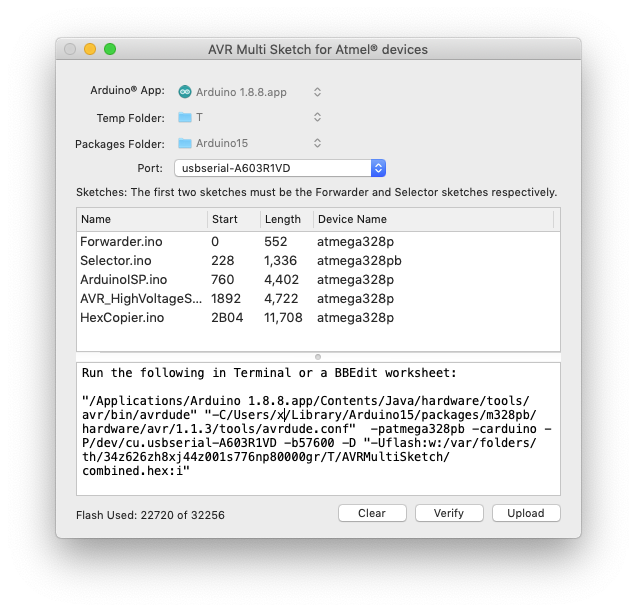
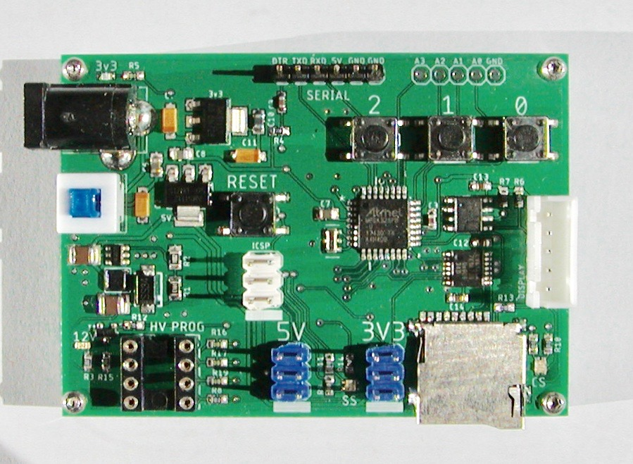
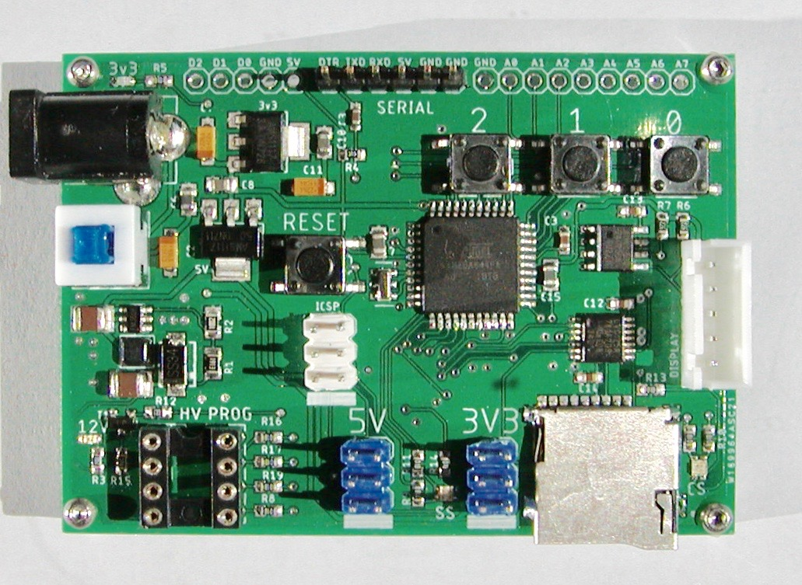

# AVRMultiSketch

AVRMultiSketch is an Objective-C OS X app that relinks and edits compiled sketch code (elf files) to allow multiple Arduino sketches to be loaded on and run from a single AVR mcu without modifying flash or the source code of the Arduino sketches in any way.

<b>On reset/power up:</b>
For every set of sketches there will always be a "Forwarder" sketch and a "Selector" sketch.  On reset, the Selector sketch allows the user to select which of the N sketches will be run, or if no selection is made, the previous sketch is run.  At this point the Selector sketch ends by setting the selected sketch's vector table address in the Forwarder sketch and jumps to "restart" within the Forwarder sketch.  The Forwarder then jumps to the reset vector of the selected sketch, at which point the selected sketch's data and bss sections are initialized and the sketch's main() is called (which eventually calls setup and loop).  The selected sketch runs till the board is reset or power is removed.

Apart from not having to touch the source code of the sub sketches, the other advantage is that the SRAM resource is nearly the same as if you were running these sketches standalone, which essentially you are, except for the Forwarder's 11 bytes.  The SRAM needed by the Selector is only used during the selection process, as currently designed, the few milliseconds after applying power or pressing reset.  The SRAM consumed by the Forwarder is only 11 bytes.  How these 11 bytes live harmoniously with the selected sketch is described in more detail later on.

<b>The trick to get this to work is the Forwarder sketch:</b>
This tiny sketch forwards any interrupts required by the sub sketches to the selected sketch.  The Forwarder contains a variable that holds the address of the selected sketch's vector table (which has been shifted, more on that later.)

# Usage

The app can be compiled as a sandboxed app or a regular app.  The difference being a sandbox app has more limitations than one that isn't.  If for some reason you'd rather use a sandboxed app, contact me for instructions.  When compiled as a sandboxed app, the first time you launch AVRMultiSketch you'll be asked to give the AVRMultiSketch permission to access items in the temporary folder created by the Arduino IDE.  You'll also be asked permission to access items in the Arduino packages folder, Arduino15.  Permission is granted by way of you, the user, selecting these folders when presented with a standard open dialog. AVRMultiSketch saves the granted access permission as bookmarks in its user defaults file.  The same action is performed for readonly access to the Arduino application bundle.  For the regular app you'll only be asked to locate the Arduino IDE.

Once that one-time bit of housekeeping is out of the way you shouldn't be bothered again.

<b>Defining the set of sketches:</b>
Drag the Forwarder.ino sketch OR its folder onto the sketch list within the GUI.  The same is done for the Selector sketch and the other sketches you want to cram into your mcu.  Once in the list you can change the order that they will physically be loaded into flash by dragging them within the sketch list. This order is also the selection order within the Selector.  You can remove a sketch by selecting it and pressing delete.  If this is a set of sketches that you may want to use more than once, you can save the set to disk and reload it from the recents menu.

The Forwarder and Selector sketches may need to be modified per your needs.  Unless you will be hosting exactly three sub sketches, you will need to modify the Selector sketch.  The lifespan of the Selector sketch, as I've defined it, is the few milliseconds it takes for the mcu to load after pressing reset.  You're free to modify the selector sketch any way you want to add a GUI, add support for a different mcu and/or a different number of sketches.  It's not a very complex sketch, you just need to define and use a few variables and a label.  The only modifications to the Forwarder sketch would be to add additional vector numbers to be forwarded.  AVRMultiSketch checks each sketch and creates a list of ISRs used.  Any ISRs not currently defined in the Forwarder will need to be added using the Forwarder FORWARD_ISR macro.

Apart from that there's not much more to it.  AVRMultiSketch will specify any changes needed via the message log.

# In-depth

When you verify a sketch in the Arduino IDE, the compiled sketch is stored in a temporary folder.  The lifespan of this folder is for as long as the Arduino IDE is running.  For this reason you must leave the Arduino IDE running while using AVRMultiSketch.  AVRMultiSketch will notify you via its message log if the IDE isn't running and for other issues that may arise.

<b>The one ISR not forwarded by the Forwarder:</b>
The Forwarder doesn't forward TIMER0_OVF_vect.  The TIMER0_OVF_vect is used by millis() and micros().  Forwarding this ISR would affect the accuracy of these functions.  All of the sub sketches use the Forwarder's TIMER0_OVF_vect to maintain timing accuracy.   AVRMultiSketch patches all of the sub sketches to use the timer global vars used in the Forwarder's ISR by way of address replacement of LDS instructions in the sub sketch's elf file. 

<b>How the Forwarder SRAM lives in harmony with the selected running sketch:</b>
The start of the data and bss sections is by default at the end of the registers memory, which for example on the ATmega328 is 0x100.  This is defined in the specs-xxx file.  There's a specs file for each device located in the device-specs folder within the Arduino IDE bundle.  Within nearly all atmega specs files the Tdata option is defined (if it's not then the app will fail).  By modifying the option value you will move the starting address used by the linker.  The first time you use a new device AVRMultiSketch will create a modified copy of the specs file and copy it to the specs folder.  Adding this modified file to the Arduino IDE bundle will not affect the starting address of anything built using Arduino or any application other than AVRMultiSketch.

<b>Creation of the final all-in-one hex file:</b>
To concatenate all of the sketches, the elf file is regenerated (relinked) for each sketch with an option to offset the text section (the modified specs-xxx noted above is for the data and bss sections.)  After generating the hex files, the hex files are nearly blindly appended to each other.  This nearly blind concatenation works because there are no address conflicts due to the offset option added during linking.

<b>Mixing devices:</b>
You can mix devices provided they are compatible, e.g. ATmega328p and ATmega328pb.  The Selector sketch's board/device determines the board params used to validate the final flash size and it sets the upload parameters, such as the baud rate.  No device compatibility validation is performed.  You're on your own, although when you go to upload the combined sketch, avrdude will fail if the Selector sketch doesn't match the actual device targeted.  If this happens you can modify the avrdude command line to ignore it or change the target device ID.

Why would you want to mix devices?  My board uses the ATmega328pb.  ATmega328pb is <i>almost</i> completely backward compatible with ATmega328p.  The ATmega328pb has a few more I/O pins, but it also has a much larger vector table.  So to save space, and if the sketch doesn't require the extra resources on the ATmega328pb, these sketches can be compiled as ATmega328p.

<b>What's been tested:</b>
I've tested this with the ATmega328p, ATmega328pb, and ATmega644p.

For the ATmega644p I used the <a href="https://github.com/MCUdude/MightyCore" name="MightyCore" title="An Arduino core for ATmega8535, ATmega16, ATmega32, ATmega164, ATmega324, ATmega644 and ATmega1284">MightyCore</a> package.

For the ATmega328pb I used the <a href="https://github.com/watterott/ATmega328PB-Testing" name="Watterott" title="Atmel/Microchip ATmega328PB support for Arduino IDE">Watterott</a> package.

Note that AVRMultiSketch will fail if a package uses an avr toolchain other than the default toolchain that comes with Arduino 1.8.7 and up.

<b>What doesn't work:</b>
- Pressing Upload will only provide the command line to be executed, it does not actually upload the hex file.  This isn't a huge inconvenience, just paste it into a BBEdit worksheet or Terminal window to execute.
- Depending on the package, the core may not be located if you've recently compiled for some other package.  FQBNs that contain lots of menu options cause Arduino to shorten the cached core filename making them hard to distinguish.  If this happens, restart the Arduino IDE and recompile the sketches by pressing the verify button for each sketch.  The AVRMultiSketch fallback when the cached core can't be located using the FQBN is to use whatever core_xxx.a is in the cache folder provided there's only one.

# Origin
I wrote AVRMultiSketch to support a board I designed.  I needed the board to perform at least 3 functions.  Even if I could merge the sketches into one, I wouldn't have enough SRAM to run them without moving to a different mcu.  Once merged, migrating changes from the original sources would be a pain. 

The board is named "AVR Programmer w/HV".  You're probably thinking: add this to the list of dozens of other AVR programmer boards.  You're probably right, but what makes this board unique is that it currently incorporates 3 distinct functions, and potentially could contain several more, each without modifying the original source code.

This board currently hosts 3 sketches plus the Forwarder and Selector sketches:
- ArduinoISP, the ISP sketch provided in the Arduino example code, slightly modified to support the ATmega644.
- AVR_HighVoltageSerialProgrammer, a version of the work by Paul Willoughby that I modified to make it somewhat more user friendly.
- HexCopier, a sketch I wrote to quickly load NOR Flash chips from a FAT image file on an SD card.  See <a href="https://github.com/JonMackey/FatFsToHex" name="FatFsToHex" title="OS X app used to create a FAT file system to be sent serially in Intel HEX format to any compatible interpreter or exported to a .hex file">FatFsToHex</a>.

There are two versions of the board, one with an ATmega328<i>pb</i> and one with an ATmega644p (or 1284P).  The reason for the version with a higher capacity chip is simply that I was placing an order with PCBWay in China anyway and wanted to try the 644a and 1284P chips.

The board has 4 buttons: reset, plus buttons 0, 1, and 2.  On reset, if 0, 1, or 2 is held down, it selects a function/sketch.  Currently there are only 3 functions, but there could be as many as 7 if the 3 bits represented by the buttons are used together (or more if a keypad is attached).

The board supports both 5V and 3v3 chips/boards.  To supply the 12 volts required for the High Voltage programmer, the board has an MT3608 DC-DC step up converter.

Adapter boards:
- ATtiny85 ICSP (DIP or SOP8)
- NOR Flash (Winbond W25Q128FVSSIG, etc.)
- ATtiny84A to ATtiny85.  This plugs in directly to the HV socket or into the ATtiny85 ICSP adapter.

Most of the boards I design don't require an adapter and the chips can be programmed in place, but for breadboarding the adapters are handy (load the chip on the adapter then move it to the breadboard).

The board also has the option of adding an AT24Cxxx I2C serial EEPROM and there's a 5 pin I2C JST-XH-05 connector (GND/5V/SCL/SDA/INT1) for adding a display and/or other I2C devices. For both board versions I brought all of the unused pins to the edge so the board could be repurposed if needed.  The reason for the serial EEPROM is that I've been using these chips to store bitmap fonts.  I wrote a MacOS app that leverages FreeType to create bitmap subset fonts for use with Arduino displays (this app also will generate the bitmaps to support the Nokia format).  If anyone is interested in the font app or the board, let me know.  If you'd like to build one yourself, the board Gerber files are be shared on PCBWay along with a parts list, see <a href="https://www.pcbway.com/project/shareproject/W169964ASC20_AVR_High_Voltage_v1_3.html" name="ATmega328pb" title="AVR Programmer w/HV">ATmega328pb</a> and/or <a href="https://www.pcbway.com/project/shareproject/AVR_High_Voltage_644PA_v1_0.html" name="ATmega644pa" title="AVR Programmer w/HV">ATmega644pa</a> versions.

